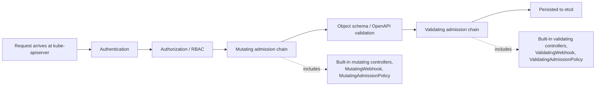

# Preventing Kyverno Policy Bypass via Webhook Unavailability

### RBAC hardening + ValidatingAdmissionPolicy as a non-circular resilience layer

**Context:** AKS, Kubernetes 1.36, Kyverno (latest — CNCF Graduated, CEL policy types GA since 1.17/1.18), `ValidatingPolicy` (VPOL)-only estate.
**Assumptions stated up front:** examples below assume Kyverno is installed via Helm into a `kyverno` namespace with default resource names — adjust to match your release. Break-glass identity names, GitOps service accounts, and Entra ID group object IDs are placeholders (`<...>`) — substitute your own.

---

## TL;DR

The most direct way to "bring the webhook down" on a Kyverno cluster isn't a network attack or a race against `failurePolicy` — it's a single `kubectl scale`.

Since Kyverno 1.9.0, the admission controller **deletes its own resource-facing webhook configurations the moment it's scaled to zero replicas**. This is intentional: it is Kyverno's own documented recovery path for a cluster wedged behind a fail-closed webhook. It means anyone holding `update`/`patch` on the `kyverno-admission-controller` Deployment (or its `scale` subresource) can disable enforcement cleanly, with no errors, no timing dependency, and no need to touch `failurePolicy` or the webhook objects directly at all.

That single fact reshapes the whole design:

1. **RBAC on the Kyverno namespace and the `admissionregistration.k8s.io` API group is the actual first line of defence** — not a nice-to-have alongside policy.
2. **A Kyverno-enforced "don't touch Kyverno" policy is circular.** It is enforced *through* the exact mechanism an attacker just removed. The moment the webhook (or the VAP autogenerated from a `ValidatingPolicy` that only Kyverno's controller keeps in sync) depends on Kyverno being alive to matter, it stops mattering at the exact moment you need it.
3. **`ValidatingAdmissionPolicy` (VAP) is structurally different and therefore useful here**, specifically because it's compiled into `kube-apiserver` itself — no Deployment, no Service, no Pod of its own to scale to zero. That's the entire reason it's worth the investigation, not because it's a newer or faster version of the same thing.
4. VAP is a **targeted backstop, not a general antidote**. It can stop specific tampering actions on specific objects; it can't fix resource exhaustion, a deleted TLS secret, or a severed NetworkPolicy. Detection remains necessary for the residual risk.

The rest of this document builds out each concept in detail, then works through the threat model, the layered defence, and the specific things worth validating empirically in your PoC — several of which are **not settled by Kyverno's own documentation**, which is presumably why the PoC needs to exist.

---

## Part 1 — Concepts

### 1.1 The Kubernetes admission pipeline, end to end

Every write request to the API server passes through the same ordered pipeline before it's persisted to etcd:



Two things matter for this ticket:

- **RBAC (authorization) happens before any admission control.** If a principal is authorized to `update` a Deployment, no admission webhook or VAP gets a vote on that request *unless a policy explicitly denies it*. RBAC is the gate; admission control is what happens once you're through the gate. This is why RBAC is foundational rather than supplementary.
- **Within the validating chain**, `ValidatingWebhookConfiguration`-based webhooks (what Kyverno uses) and `ValidatingAdmissionPolicy` objects are peers — both run inside the same "Validating admission chain" box — but they get there completely differently, which is the crux of everything below.

### 1.2 How Kyverno's webhook enforcement actually works

Kyverno is a **dynamic admission controller**: a workload running in your cluster (the `kyverno-admission-controller` Deployment, typically in a `kyverno` namespace) that the API server calls out to over HTTPS for every request that matches a registered webhook rule.

Kyverno doesn't run one static webhook — it dynamically manages several `ValidatingWebhookConfiguration` / `MutatingWebhookConfiguration` objects and rewrites their `rules[]` as policies are added, changed, or removed, so the API server only forwards requests that some installed policy actually cares about. The default set (names may vary slightly by chart version) includes:

| Webhook object | Purpose |
|---|---|
| `kyverno-resource-validating-webhook-cfg` | Validates the actual resources your policies target (Pods, Deployments, etc.) — **this is the one that matters for policy enforcement** |
| `kyverno-resource-mutating-webhook-cfg` | Mutation equivalent of the above |
| `kyverno-policy-validating-webhook-cfg` | Validates Kyverno's own policy CRDs on creation (catches malformed policies) |
| `kyverno-cleanup-validating-webhook-cfg`, `kyverno-exception-validating-webhook-cfg`, `kyverno-verify-mutating-webhook-cfg`, `kyverno-ttl-validating-webhook-cfg` | Internal/auxiliary — not typically involved in resource enforcement |

A few operational details that matter for the threat model in Part 2:

- **failurePolicy** governs what happens if the API server can't get a usable answer from the webhook (network error, timeout, non-2xx, malformed response, TLS failure): `Fail` blocks the matching request (fail-closed); `Ignore` admits it as if no webhook existed (fail-open). Kyverno also ships a controller flag, `--forceFailurePolicyIgnore`, that overrides whatever individual policies request and forces every managed webhook to `Ignore` — a single Deployment-spec change with cluster-wide fail-open consequences.
- **Kyverno excludes its own namespace from the resource webhook by default** (since Helm chart 2.5.0) to avoid a self-deadlock. On AKS, the platform separately guarantees `kube-system` and AKS-internal namespaces are excluded (more in Part 4) — so those two specific gaps are already handled for you, they're not something you need to configure.
- **A `resourceFilters` setting in the Kyverno ConfigMap** provides a second, coarser exclusion mechanism (kind/namespace/name patterns Kyverno won't forward to itself at all, independent of any policy's own match/exclude blocks). It's a legitimate operational tool — and also a place where a quietly-added entry can create a silent gap.
- **High availability**: the admission controller doesn't use leader election for handling inbound `AdmissionReview` calls (any replica can answer), but *does* use leader election for certificate and webhook-object management, so only one replica reconciles the webhook configs at a time. Kyverno recommends a minimum of three replicas.
- So long as a `ValidatingWebhookConfiguration` object **exists**, the API server treats it as authoritative and will attempt delivery — even if the backing Service has no healthy endpoints. Availability of the *backend* and existence of the *configuration object* are two separate failure domains, and each is attacked differently (see Part 2).

### 1.3 ValidatingAdmissionPolicy (VAP): Kubernetes' native, in-process alternative

`ValidatingAdmissionPolicy` (`admissionregistration.k8s.io/v1`) is a built-in Kubernetes mechanism, GA since 1.30 (your clusters, on 1.36, have had it for a long time). It lets you declare validation rules using CEL (Common Expression Language) directly as a Kubernetes object — no external service required.

Two objects work together:

- **`ValidatingAdmissionPolicy`** — defines `matchConstraints` (which resources/operations trigger it) and `validations` (CEL expressions that must evaluate `true` to admit the request), optionally parameterised via `paramKind`/a params object for values cluster-admins can tune without editing CEL.
- **`ValidatingAdmissionPolicyBinding`** — binds the policy to a scope (namespace/object selectors) and sets `validationActions` (`Deny`, `Warn`, `Audit`).

The property that matters most for this ticket: **VAP evaluation happens inside the `kube-apiserver` process itself.** It's compiled into the same binary that lists the admission controllers as "may only be configured by the cluster administrator." There is no Pod, no Service, no Deployment, no network hop, and therefore nothing to scale to zero, DoS, or sever with a NetworkPolicy. VAP does still have its own `failurePolicy`, but that now only covers CEL *runtime* errors (e.g. a bad params lookup) — the entire class of "the backend is unreachable" failures that affects webhooks doesn't exist for VAP, because there is no backend.

This is also its limitation: CEL alone can't do everything a full policy engine can (external HTTP calls, image signature verification, generating other resources, background reconciliation) — hence Kyverno's `ValidatingPolicy` wrapper below, rather than hand-writing raw VAP for everything.

### 1.4 Kyverno's `ValidatingPolicy` (VPOL): a superset of VAP

`ValidatingPolicy` (`policies.kyverno.io/v1` — promoted from `v1alpha1` to stable `v1` in Kyverno 1.17, confirmed stable as of 1.18) is Kyverno's CEL-native policy type and, per Kyverno's own comparison, is explicitly a **superset** of the native `ValidatingAdmissionPolicy` schema: it accepts the same `matchConstraints`/`validations` shape, plus Kyverno-specific fields for evaluation mode, webhook tuning, reporting, and — most relevantly here — **autogeneration**.

```yaml
apiVersion: policies.kyverno.io/v1
kind: ValidatingPolicy
metadata:
  name: require-team-label
spec:
  validationActions:
    - Deny
  matchConstraints:
    resourceRules:
      - apiGroups: ["apps"]
        apiVersions: ["v1"]
        operations: ["CREATE", "UPDATE"]
        resources: ["deployments"]
  validations:
    - message: "label 'team' is required"
      expression: "has(object.metadata.labels) && 'team' in object.metadata.labels"
```

Key comparison points, from Kyverno's own docs:

| Feature | Native `ValidatingAdmissionPolicy` | Kyverno `ValidatingPolicy` |
|---|---|---|
| Enforcement | Admission only | Admission, background scan, CLI/pipeline |
| Bindings | Manual (`...Binding` object) | Automatic |
| Auto-generation | — | Pod-controller rules **and native VAP** |
| Exceptions | — (none) | Fine-grained `PolicyException` support |
| Reporting | — | `PolicyReport`s |

A `NamespacedValidatingPolicy` variant exists for delegating policy authorship to namespace owners without granting cluster-admin — worth knowing about given the self-service PolicyException model you've already built for the platform, though the two are separate concerns (that model governs *exceptions* to centrally-owned policies; `NamespacedValidatingPolicy` would let a team own a *policy* outright).

`spec.failurePolicy` (webhook-call-error behaviour) and `spec.validationActions` (what happens on a genuine rule violation: `Deny`/`Warn`/`Audit`) are separate knobs — don't conflate them when reading or writing these policies.

### 1.5 Autogeneration: turning a VPOL into a native VAP + Binding

This is the mechanism the ticket is really asking about. A `ValidatingPolicy` can carry:

```yaml
spec:
  autogen:
    validatingAdmissionPolicy:
      enabled: true
    podControllers:
      controllers: [deployments, replicasets, daemonsets, statefulsets, jobs, cronjobs]
```

When `autogen.validatingAdmissionPolicy.enabled: true` and the policy's CEL is expressible in plain VAP terms (no calls to Kyverno-only CEL library functions, no image verification, no external data lookups), Kyverno's controller projects the `ValidatingPolicy` into a genuine native `ValidatingAdmissionPolicy` + `ValidatingAdmissionPolicyBinding`, named after the source policy (binding gets a `-binding` suffix), labelled `app.kubernetes.io/managed-by: kyverno`, and owned by the source policy. You can confirm generation succeeded via the policy's `.status.validatingadmissionpolicy.generated` field.

This gives you two enforcement paths for the same rule simultaneously:

- **Kyverno's own webhook path** — full feature set, reporting, background scans, exceptions — active whenever Kyverno is healthy.
- **The generated native VAP** — evaluated in-process by `kube-apiserver`, active regardless of whether Kyverno is running.

Two important properties of the generated objects:

- **Self-healing while Kyverno is up:** Kyverno's controller actively reverts drift on the generated VAP/Binding — if someone hand-edits or deletes them while Kyverno is healthy, it puts them back.
- **Independence once created:** because they're ordinary `admissionregistration.k8s.io` objects, once created they keep being enforced by `kube-apiserver` even if Kyverno the workload disappears entirely. You get self-healing *and* independence — the combination a hand-authored, unmanaged VAP doesn't give you on its own (no controller reverting tampering unless your own GitOps tooling does that job).

Auditing which of your policies are even eligible for this — which is what you're doing against the `policies/` repo tree — matters because not everything qualifies; anything leaning on Kyverno-only CEL library functions, `context` lookups, image verification, or `generate`/`mutate` behaviour has no native VAP equivalent to project into.

### 1.6 PolicyException and CEL-based exceptions for VPOL

Since Kyverno 1.14.0, `PolicyException` (new API group `policies.kyverno.io`) supports CEL-based exceptions for the new policy types:

```yaml
apiVersion: policies.kyverno.io/v1alpha1
kind: PolicyException
metadata:
  name: exclude-skipped-deployment
  namespace: default
spec:
  policyRefs:
    - name: require-team-label
      kind: ValidatingPolicy
  matchConditions:
    - name: skip-by-name
      expression: "object.metadata.name == 'skipped-deployment'"
```

This works "in both admission and background modes" per Kyverno's own docs — i.e., it's honoured when Kyverno's own webhook/controller evaluates the policy. **Nowhere in Kyverno's current `ValidatingPolicy` or `PolicyException` documentation is it explicitly stated whether — or how — a `policies.kyverno.io PolicyException` propagates into the *autogenerated native VAP + Binding*.**

That silence is worth taking seriously rather than assuming best-case. Contrast this with the *older* mechanism: Kyverno 1.13 documented, explicitly and with an example, that a `kyverno.io/v2 PolicyException` attached to a **`ClusterPolicy`** using the legacy `validate.cel` subrule gets translated into the generated VAP's `matchConstraints.excludeResourceRules`. That was a deliberate, documented feature addition (tracked as kyverno/kyverno#8733) for the *old* policy type. The equivalent statement doesn't exist yet for `ValidatingPolicy` + the new CEL-native `PolicyException`. This is precisely the gap your PoC is testing empirically, and it's the right thing to be testing rather than trusting by inference — see Part 5.

One thing that likely *does* work predictably, because it doesn't depend on cross-referencing a separate object at generation time: Kyverno 1.18 added a native `spec.excludes` block directly on `ValidatingPolicy` (namespace, subject, resource-rule, and custom `matchConditions` exclusions, per the release notes) as part of the policy's own spec. Because autogen reads the policy's own spec to build the native VAP, an exclusion declared this way is a stronger candidate for reliably surviving the VAP-generation step than a separately-linked `PolicyException`. The exact schema wasn't pinned down in the docs snapshot used for this document — check `kubectl explain validatingpolicy.spec.excludes` on your cluster — but it's worth including as a second thing to A/B test alongside `PolicyException` propagation.

---

## Part 2 — Threat model: how the webhook can actually be brought down

### 2.1 The headline risk: scaling the admission controller to zero

Documented by Kyverno itself, in its own troubleshooting guide, as the **recommended recovery step** for a cluster wedged behind a fail-closed webhook:

> *"Delete the Kyverno Pods or scale the Deployment down to zero and then up… When Kyverno recovers, its webhooks will be recreated based on the currently-installed policies."*

Since Kyverno 1.9.0, scaling `kyverno-admission-controller` to zero replicas **deletes** `kyverno-resource-validating-webhook-cfg` (and its mutating counterpart) as a side effect. This was originally added so `helm uninstall` doesn't leave an orphaned fail-closed webhook behind, but it applies to *any* scale-to-zero, not only uninstalls (tracked, and accepted as by-design, in kyverno/kyverno#6554 — "this potentially opens door for attackers").

Consequence: **`kubectl scale deploy/kyverno-admission-controller -n kyverno --replicas=0` is a clean, error-free, silent way to disable Kyverno's resource enforcement**, requiring only `update`/`patch` on that one Deployment (or its `scale` subresource). No `failurePolicy` fight, no timing race, no error in the API server's response. This is the single highest-leverage fact in this whole document — everything in Part 3 is built around addressing it.

### 2.2 Full vector table

| # | Vector | Mechanism | Needs |
|---|---|---|---|
| 1 | **Scale admission controller to 0** | Deletes `kyverno-resource-*-webhook-cfg` outright (§2.1) | `update`/`patch` on Deployment or its `scale` subresource |
| 2 | Direct delete of webhook config objects | API server stops forwarding requests immediately | `delete` on `admissionregistration.k8s.io` objects |
| 3 | Delete/evict Pods without scaling to 0 | Transient only — the ReplicaSet recreates them | `delete` on Pods (insufficient alone) |
| 4 | Flip `failurePolicy` `Fail` → `Ignore` on the webhook object, or on the source `ValidatingPolicy`'s `spec.failurePolicy` | Any webhook error now silently admits instead of blocking | `update`/`patch` on the webhook object or the VPOL |
| 5 | `--forceFailurePolicyIgnore` controller flag | Forces every Kyverno-managed webhook to fail-open, cluster-wide, regardless of individual policy settings | `update`/`patch` on the Deployment spec (container args) |
| 6 | Delete/corrupt the TLS Secret Kyverno serves its webhook cert from | TLS handshake fails → webhook errors → `failurePolicy` decides the outcome | `delete`/`update` on the Secret |
| 7 | Resource exhaustion / request flooding | Webhook times out under load → same `failurePolicy` fork | Workload-level access, no special RBAC |
| 8 | NetworkPolicy / firewall change severing apiserver ⇄ Kyverno service path | Same as above — timeout/connection-refused → `failurePolicy` fork | `update` on NetworkPolicy resources |
| 9 | Add a namespace-exclusion or a `resourceFilters` ConfigMap entry | Silently narrows what Kyverno ever sees, no error at all | `update`/`patch` on the webhook object or the Kyverno ConfigMap |
| 10 | RBAC/privilege-escalation onto any of the above | `bind`/`escalate` verbs on ClusterRoles, over-broad group membership, widened Kyverno ServiceAccount permissions | Pre-existing RBAC misconfiguration |
| 11 | Payload/webhook-confusion attacks (e.g. crafted mutating-webhook responses that desync the validating pass), ephemeral-container and Job/CronJob template evasion | Different attack class entirely — bypasses coverage rather than availability | Out of scope for this document; worth a separate review of match rules and known CVE classes (e.g. CVE-2021-25735) |

Rows 1, 2, 4, 5 and 9 are the ones an admission-time control (RBAC or VAP) can actually prevent. Rows 6–8 are infrastructure/availability problems that no admission-control layer touches — they need detection and standard operational hardening instead (redundant replicas, resource requests/limits, NetworkPolicy review), not a policy fix.

### 2.3 What's already handled for you — and what to double-check

- Kyverno excludes its own namespace from the resource webhook by default (chart ≥2.5.0) — you don't need to add this.
- AKS's built-in admissions enforcer automatically excludes `kube-system` and AKS-internal namespaces from *every* custom `ValidatingWebhookConfiguration`/`MutatingWebhookConfiguration` in the cluster, Kyverno's included — also not something you need to configure (details in Part 4).
- Neither of those protects the webhook *configuration objects*, the Deployment, the Secret, or the ConfigMap from RBAC-based tampering — that's the gap this document addresses.

---

## Part 3 — Layered defence

### Layer 1: RBAC — the actual first line of defence

Because row 1 in the vector table needs nothing more than ordinary Deployment-scale permissions, tightening RBAC on the `kyverno` namespace and the cluster-scoped admission objects is not optional hardening alongside the VAP work — it's the control that closes the cheapest, highest-impact path. Official Kubernetes guidance on webhook good practice is explicit that `create`, `update`, `patch`, `delete`, and `deletecollection` on webhook configuration objects should be restricted to trusted entities; the same principle needs extending to the Deployment, Secret, and ConfigMap that back it.

```yaml
apiVersion: rbac.authorization.k8s.io/v1
kind: ClusterRole
metadata:
  name: kyverno-control-plane-admin
rules:
  - apiGroups: ["admissionregistration.k8s.io"]
    resources:
      - validatingwebhookconfigurations
      - mutatingwebhookconfigurations
      - validatingadmissionpolicies
      - validatingadmissionpolicybindings
    verbs: ["update", "patch", "delete", "deletecollection"]
  - apiGroups: ["apps"]
    resources: ["deployments", "deployments/scale"]
    verbs: ["update", "patch", "delete"]
    resourceNames: ["kyverno-admission-controller", "kyverno-background-controller",
                     "kyverno-cleanup-controller", "kyverno-reports-controller"]
  - apiGroups: [""]
    resources: ["secrets", "configmaps"]
    verbs: ["update", "patch", "delete"]
---
apiVersion: rbac.authorization.k8s.io/v1
kind: ClusterRoleBinding
metadata:
  name: kyverno-control-plane-admin-breakglass
subjects:
  - kind: Group
    name: "<platform-breakglass-group-object-id>"
    apiGroup: rbac.authorization.k8s.io
  - kind: ServiceAccount
    name: "<gitops-service-account>"
    namespace: "<gitops-namespace>"
roleRef:
  kind: ClusterRole
  name: kyverno-control-plane-admin
  apiGroup: rbac.authorization.k8s.io
```

Notes on adapting this:

- This uses a `ClusterRoleBinding`, not the namespace-scoped `RoleBinding` pattern from your self-service PolicyException model — deliberately. `ValidatingWebhookConfiguration` and `ValidatingAdmissionPolicy` are cluster-scoped objects, and the Deployment/Secret/ConfigMap protection needs to hold even for principals who otherwise have broad namespace-level access elsewhere in the cluster. Don't reuse the `system:serviceaccounts:<namespace>` group-binding pattern here — that pattern is right for delegating *exceptions* to teams, wrong for protecting the control plane itself.
- If you already grant any group `cluster-admin` broadly, this `ClusterRole` alone does nothing — `cluster-admin` bypasses everything. The realistic goal is closing the gap between "ordinary platform-engineer access" and "can quietly disable enforcement," not defending against a fully-privileged compromise.
- `bind` and `escalate` verbs on `ClusterRole`/`Role` objects are a general RBAC blind spot worth checking cluster-wide while you're in this area: a principal holding either can grant itself permissions it doesn't currently have, including the ones above.
- Kyverno's own `kyverno-admission-controller` ServiceAccount legitimately needs `update` on its own TLS Secret (self-signed cert rotation, if you're not using an external issuer) — this `ClusterRole` intentionally doesn't carve that out; grant it via a separate, narrower binding scoped only to that SA if needed, rather than loosening the rule above.
- Given your hybrid PolicyException model, make sure self-service `PolicyException` creation is explicitly excluded from covering the "protect Kyverno" policies below (Layer 3) — an exception that exempts someone from the anti-tamper policy is functionally equivalent to bypassing it.

### Layer 2: why a Kyverno-enforced "protect Kyverno" policy is circular

Kyverno's own docs recommend a self-protection pattern along these lines — deny deletes on Kyverno-managed objects unless the requester holds `cluster-admin`:

```yaml
apiVersion: kyverno.io/v1
kind: ClusterPolicy
metadata:
  name: deny-kyverno-resource-deletes
spec:
  validationFailureAction: Enforce
  background: false
  rules:
    - name: block-deletes-for-kyverno-resources
      match:
        any:
          - resources:
              selector:
                matchLabels:
                  app.kubernetes.io/managed-by: kyverno
      exclude:
        any:
          - clusterRoles: ["cluster-admin"]
      validate:
        message: "Deleting Kyverno-managed resources is not allowed."
        deny:
          conditions:
            any:
              - key: "{{ request.operation }}"
                operator: Equals
                value: DELETE
```

Worth having as defence-in-depth for the "Kyverno is healthy but someone tries to delete a policy-managed resource" case — but it does **nothing** against Vector 1. It is enforced *through Kyverno's own webhook*. The exact moment an attacker scales the admission controller to zero, this policy — along with every other policy you've written — stops being enforced, because the mechanism enforcing it just vanished. Writing more Kyverno policy to protect Kyverno is protecting the lock with a key kept inside the safe it locks. This is precisely the gap ValidatingAdmissionPolicy is structurally positioned to fill.

### Layer 3: ValidatingAdmissionPolicy as the non-circular backstop

**What it can and can't do here:**

| Vector | Can VAP stop it? | Why |
|---|---|---|
| 1. Scale to zero | ✅ (via a rule denying the scale action itself) | Evaluated in-process, independent of whether Kyverno is running |
| 2. Delete webhook/VAP objects | ✅ | Same — but the *protecting* VAP/Binding itself needs RBAC protection too (see below) |
| 4. Flip `failurePolicy` | ✅ (deny the update) | Same |
| 5. `--forceFailurePolicyIgnore` flag | ✅ (deny the Deployment spec change) | Same |
| 9. Namespace/`resourceFilters` exclusion | ✅ (deny the update) | Same |
| 6. Secret deletion, 7. resource exhaustion, 8. NetworkPolicy severance | ❌ | Infrastructure/availability problems, not admission-control-shaped problems |

The recommended approach is to author these as `ValidatingPolicy` with `autogen.validatingAdmissionPolicy.enabled: true`, so you get Kyverno's self-healing reconciliation while Kyverno is healthy *and* independent native-VAP enforcement once it isn't — rather than hand-authoring raw VAP objects that nothing keeps in sync.

Rather than trying to scope this precisely to "only Kyverno's objects" via labels — which differ across object kinds (webhook configs carry `webhook.kyverno.io/managed-by: kyverno`; Kyverno-generated VAP/Binding objects carry `app.kubernetes.io/managed-by: kyverno` — two different keys, which makes a single clean label selector brittle) — it's both simpler and arguably more correct to protect the **entire resource kind** cluster-wide. An attacker doesn't care whether they're disabling Kyverno specifically or any other admission-control layer in the cluster, and a platform team should want the same break-glass control over all of them:

```yaml
apiVersion: policies.kyverno.io/v1
kind: ValidatingPolicy
metadata:
  name: protect-admission-control-objects
spec:
  validationActions:
    - Deny
  matchConstraints:
    resourceRules:
      - apiGroups: ["admissionregistration.k8s.io"]
        apiVersions: ["v1"]
        operations: ["UPDATE", "DELETE"]
        resources:
          - validatingwebhookconfigurations
          - mutatingwebhookconfigurations
          - validatingadmissionpolicies
          - validatingadmissionpolicybindings
  autogen:
    validatingAdmissionPolicy:
      enabled: true
  validations:
    - message: >-
        Changes to cluster admission-control objects are restricted to the
        platform GitOps identity and the break-glass group. Raise this
        through the platform change process.
      expression: >-
        request.userInfo.username == "system:serviceaccount:<gitops-ns>:<gitops-sa>" ||
        request.userInfo.username == "system:serviceaccount:kyverno:kyverno-admission-controller" ||
        request.userInfo.groups.exists(g, g == "<platform-breakglass-group-object-id>")
```

```yaml
apiVersion: policies.kyverno.io/v1
kind: ValidatingPolicy
metadata:
  name: protect-kyverno-namespace-workloads
spec:
  validationActions:
    - Deny
  matchConstraints:
    namespaceSelector:
      matchLabels:
        kubernetes.io/metadata.name: kyverno    # adjust to your release namespace
    resourceRules:
      - apiGroups: ["apps"]
        apiVersions: ["v1"]
        operations: ["UPDATE", "DELETE"]
        resources: ["deployments", "deployments/scale"]
      - apiGroups: [""]
        apiVersions: ["v1"]
        operations: ["UPDATE", "DELETE"]
        resources: ["secrets", "configmaps"]
  autogen:
    validatingAdmissionPolicy:
      enabled: true
  validations:
    - message: >-
        Changes to Kyverno's own Deployments (including scaling), TLS
        secret, and configuration are restricted to the platform GitOps
        identity and the break-glass group.
      expression: >-
        request.userInfo.username == "system:serviceaccount:<gitops-ns>:<gitops-sa>" ||
        request.userInfo.groups.exists(g, g == "<platform-breakglass-group-object-id>")
```

A few design notes on these two:

- `request.userInfo.username`/`.groups` mirror the same fields you'd use in a webhook `matchConditions` CEL expression — same admission request context throughout Kubernetes' CEL surface.
- **AKS + Entra ID specific:** with AKS-managed Entra ID integration, `request.userInfo.groups` is typically populated with Entra group **object IDs (GUIDs)**, not display names. Confirm the exact format from a live `AdmissionReview` audit record before relying on the literal string match above.
- The second policy deliberately keeps `UPDATE` and `DELETE` under one allow-list rather than splitting out Kyverno's own cert-rotation `UPDATE` on its Secret from the more clearly attack-shaped `DELETE`. That finer distinction belongs in RBAC (Layer 1), which handles per-verb, per-identity rules natively — this backstop's job is narrower: make sure *no other identity* can touch these objects at all.
- The generated VAP/Binding from these two policies are themselves ordinary `admissionregistration.k8s.io` objects — Layer 1's RBAC needs to cover them too (it already does, in the ClusterRole above). VAP's resilience comes from not needing a running Pod, not from being immune to a sufficiently-privileged `kubectl delete`.

### Layer 3b: VAP as a policy floor, not just a lock

The same autogen mechanism is worth applying to a small set of baseline controls so that even a *fully absent* Kyverno (not just a tampered-with one) leaves a floor of protection in place — this is presumably why `disallow-host-ports` and `disallow-host-path` are your chosen PoC examples: they're PSS Baseline controls, cheap to express in CEL, and genuinely dangerous to lose entirely.

```yaml
apiVersion: policies.kyverno.io/v1
kind: ValidatingPolicy
metadata:
  name: disallow-host-path
spec:
  validationActions:
    - Deny
  matchConstraints:
    resourceRules:
      - apiGroups: [""]
        apiVersions: ["v1"]
        operations: ["CREATE", "UPDATE"]
        resources: ["pods"]
  autogen:
    validatingAdmissionPolicy:
      enabled: true
    podControllers:
      controllers: [deployments, replicasets, daemonsets, statefulsets, jobs, cronjobs]
  validations:
    - message: "HostPath volumes are not allowed (spec.volumes[*].hostPath must be unset)."
      expression: >-
        !has(object.spec.volumes) ||
        object.spec.volumes.all(v, !has(v.hostPath))
```

```yaml
apiVersion: policies.kyverno.io/v1
kind: ValidatingPolicy
metadata:
  name: disallow-host-ports
spec:
  validationActions:
    - Deny
  matchConstraints:
    resourceRules:
      - apiGroups: [""]
        apiVersions: ["v1"]
        operations: ["CREATE", "UPDATE"]
        resources: ["pods"]
  autogen:
    validatingAdmissionPolicy:
      enabled: true
    podControllers:
      controllers: [deployments, replicasets, daemonsets, statefulsets, jobs, cronjobs]
  validations:
    - message: "Setting hostPort is not allowed (containers[*].ports[*].hostPort must be unset or 0)."
      expression: >-
        object.spec.containers.all(c,
          !has(c.ports) || c.ports.all(p, !has(p.hostPort) || p.hostPort == 0))
    - message: "Setting hostPort is not allowed on init containers."
      expression: >-
        !has(object.spec.initContainers) ||
        object.spec.initContainers.all(c,
          !has(c.ports) || c.ports.all(p, !has(p.hostPort) || p.hostPort == 0))
```

These are original, minimal implementations for illustration — extend to cover `ephemeralContainers` and match your upstream `kyverno/policies` versions exactly before treating them as production-ready, given that's the source your `sync-upstream.py` pipeline already tracks.

### Layer 3c — what changes when autogen is the default for every `ValidatingPolicy`

The plan as stated is broader than the two floor-tier examples above — standardising this block across the whole `ValidatingPolicy` catalogue, not just a couple of PSS Baseline policies:

```yaml
spec:
  autogen:
    validatingAdmissionPolicy:
      enabled: true
    podControllers:
      controllers: []
```

A few things change once "two example policies" becomes "all of them":

**`podControllers.controllers` needs an explicit list — it's a separate mechanism from the VAP autogen sitting next to it.** Both live under `spec.autogen`, but they do different jobs: `validatingAdmissionPolicy.enabled` projects the policy into a native VAP; `podControllers.controllers` additionally generates the equivalent rule for Pod-controller kinds (Deployment, ReplicaSet, DaemonSet, StatefulSet, Job, CronJob), so a policy written against bare Pods also catches them arriving via a controller — the CEL-native version of Kyverno's long-standing pod-controller autogen. Left empty (as in the snippet above), only policies that already match Pod-controller kinds directly get that coverage; anything Pod-scoped stays Pod-scoped only. The value used in Layer 3b's examples —

```yaml
    podControllers:
      controllers: [deployments, replicasets, daemonsets, statefulsets, jobs, cronjobs]
```

— is the sensible default for a blanket rollout, but worth confirming against your actual controller mix (DaemonSet/CronJob-heavy vs. Deployment-only workloads) rather than copying verbatim.

**Not every policy is autogen-eligible, and `enabled: true` doesn't error out the ones that aren't — it silently leaves them without a native backstop.** Anything using Kyverno-only CEL library functions, `context`/external data lookups, image verification, or `generate`/`mutate` behaviour has no VAP equivalent to project into. Kyverno reflects this per-policy in `.status.validatingadmissionpolicy.{generated,message}` rather than rejecting the policy — the right failure mode operationally (webhook-path enforcement keeps working either way) but it means a blanket rollout needs its own compliance check rather than an assumption that the spec block alone guarantees a floor:

```bash
kubectl get validatingpolicy -o json | \
  jq -r '.items[] | select(.spec.autogen.validatingAdmissionPolicy.enabled==true) |
    select(.status.validatingadmissionpolicy.generated!=true) |
    .metadata.name'
```

This lists every policy that *asked* for a native backstop and didn't get one — exactly the gap this ticket is trying to close. It's a natural extension of the `policies/` repo audit you're already running to work out which policies are VAP-capable in the first place; that audit tells you before rollout, this check tells you after.

**Kyverno's own ServiceAccount needs broader permissions.** Per Kyverno's docs, managing `ValidatingAdmissionPolicy`/`ValidatingAdmissionPolicyBinding` objects requires granting the admission-controller ServiceAccount additional RBAC beyond the defaults — expected and a one-off change, but worth flagging against Layer 1: the more cluster-scoped power `kyverno-admission-controller`'s own SA carries in order to manage ~200 VAP/Binding pairs, the more that SA's token and the ClusterRole(s) bound to it become worth protecting under the same "restrict update/patch/delete to the break-glass group" logic as everything else in Layer 1. This is Kyverno's own legitimate privilege, not an attacker's — but the blast radius of it being misused, accidentally or otherwise, grows with the number of objects it now manages.

**No shared CEL cost-budget risk across policies, but latency is still worth watching.** Per the Kubernetes API reference, each `(policy, binding, param)` evaluation gets an *independent* CEL cost budget — adding more `ValidatingAdmissionPolicy` objects doesn't cause existing ones to start failing their own budget check, so there's no collision risk from scaling autogen up to the full catalogue. What does grow is the amount of synchronous in-process CEL evaluation the API server performs per matching request as the number of active generated VAPs climbs into the hundreds — the same kind of consideration as a long webhook chain, just without the network hop. Worth a latency check on `kube-apiserver` admission metrics after a batch rollout rather than assuming "in-process" means "free."

**Object count roughly doubles.** ~200 policies × (1 `ValidatingAdmissionPolicy` + 1 `ValidatingAdmissionPolicyBinding`) is a few hundred extra cluster-scoped objects for Kyverno's controller to reconcile and for `kube-apiserver`/etcd to hold — not usually significant at this scale, but worth a sanity check given the size of your catalogue.

**Part 5, Q1 now applies estate-wide rather than to two example policies.** Whether `PolicyException`s reliably propagate into generated VAPs matters a lot more once "all `ValidatingPolicy`" includes every policy your self-service exception model already grants teams exceptions against. Settle that empirically before flipping `validationActions` to `Deny` catalogue-wide — an exception that silently stops working the moment it's needed is worse than no exception process at all.

**Suggested sequencing for the blanket rollout:** enable `autogen.validatingAdmissionPolicy.enabled: true` in batches — start with the PSS-Baseline "floor" tier already in your PoC, confirm generation, exception behaviour, and latency are all clean, then expand by category rather than flipping it for all ~200 policies simultaneously. The failure mode to design against isn't "it doesn't work" — Kyverno degrades gracefully per-policy — it's "it silently doesn't cover what you assumed it covered," which the compliance check above exists to catch.

### Layer 4: detect what you can't (or choose not to) block

Vectors 6–8 in the table (Secret deletion, resource exhaustion, NetworkPolicy severance) aren't admission-control problems, and even the ones VAP *can* block are worth alerting on — a spike in denied attempts against `protect-admission-control-objects` is itself a signal worth routing somewhere.

**Kubernetes/AKS audit log.** On AKS, enable the `kube-audit-admin` diagnostic category (covers mutating requests only — lower volume than full `kube-audit`, sufficient here) to Log Analytics, then alert on the relevant verb/resource combinations. Illustrative KQL (table name depends on whether your Diagnostic Setting uses the legacy `AzureDiagnostics` or resource-specific mode):

```kql
AzureDiagnostics
| where Category == "kube-audit-admin"
| extend auditLog = parse_json(log_s)
| where auditLog.verb in ("update", "patch", "delete")
| where (auditLog.objectRef.resource == "deployments" and auditLog.objectRef.namespace == "kyverno")
     or (auditLog.objectRef.resource in
         ("validatingwebhookconfigurations", "mutatingwebhookconfigurations",
          "validatingadmissionpolicies", "validatingadmissionpolicybindings"))
     or (auditLog.objectRef.resource in ("secrets", "configmaps") and auditLog.objectRef.namespace == "kyverno")
| project TimeGenerated, user = auditLog.user.username, verb = auditLog.verb,
          resource = auditLog.objectRef.resource, name = auditLog.objectRef.name
```

The same filter logic is worth adding as a panel alongside your existing Kyverno metrics DQL dashboard in Dynatrace, if audit logs are (or can be) forwarded there too.

**Falco.** Your current Falco configuration is syscall-based (host/container runtime behaviour) — it does not natively see Kubernetes API-level operations like a `kubectl scale`. Detecting this specific class of event needs the Kubernetes-audit-log event source (the `k8saudit` plugin), evaluated as a separate source alongside your existing syscall rules, not an extension of them. Illustrative rule shape (verify exact `ka.*` field names against your plugin version before deploying):

```yaml
- rule: Kyverno Admission Controller Scaled Down
  desc: Detects the Kyverno admission-controller Deployment being scaled to zero
  condition: >
    ka.verb in (update, patch) and
    ka.target.resource=deployments and
    ka.target.namespace=kyverno and
    ka.target.name=kyverno-admission-controller and
    ka.req.deployment.spec.replicas=0
  output: >
    Kyverno admission controller scaled to zero (user=%ka.user.name verb=%ka.verb)
  priority: CRITICAL
  source: k8s_audit
  tags: [kyverno, admission-control]
```

If wiring up the audit-log plugin isn't already part of your Falco footprint, the AKS-audit-log route above is the lower-effort path to the same detection outcome — worth deciding which one owns this rather than building both.

---

## Part 4 — AKS-specific notes

- **AKS's admissions enforcer** automatically patches `namespaceSelector` on every `ValidatingWebhookConfiguration`/`MutatingWebhookConfiguration` in the cluster to exclude namespaces labelled `control-plane: "true"` or `kubernetes.azure.com/managedby: aks` — this is how `kube-system` and AKS-internal namespaces stay protected from any custom admission controller, Kyverno included, without you configuring anything. It can be opted out per-webhook via the `admissions.enforcer/disabled: "true"` annotation if there's ever a genuine need to cover those namespaces (not recommended).
- This has caused real interoperability friction historically — Kyverno itself hit an "endless webhook reconciliation loop" on AKS (kyverno/kyverno#6539) from the enforcer and Kyverno's own webhook controller each rewriting `namespaceSelector`. If you see excessive `"webhook configuration was deleted, recreating"` log lines, this is the first place to check, though it may or may not still reproduce on current Kyverno/AKS versions.
- The enforcer's patching, per every source describing its mechanism, targets `ValidatingWebhookConfiguration`/`MutatingWebhookConfiguration` objects specifically. Whether it also patches `ValidatingAdmissionPolicyBinding.spec.matchResources.namespaceSelector` isn't confirmed in current public documentation — worth checking empirically (create a binding scoped cluster-wide, inspect it immediately after creation) since it changes whether your generated bindings need their own explicit `kube-system` exclusion or get one for free. In practice the Kyverno namespace itself is very unlikely to carry AKS-managed labels (it's a user-installed workload, not an AKS-internal one), so this mainly matters for any VAP you scope broadly across the whole cluster rather than specifically at the `kyverno` namespace.
- Kubernetes 1.36 (your cluster version) has had `ValidatingAdmissionPolicy` GA since 1.30 — no version gap to worry about here.

---

## Part 5 — Open questions worth settling in your PoC

These are the places this document had to say "verify empirically" rather than "here's the answer," because Kyverno's current documentation doesn't settle them:

1. **Does a `policies.kyverno.io PolicyException` attached to a `ValidatingPolicy` propagate into the autogenerated native VAP + Binding?** Documented and confirmed for the *old* `kyverno.io/v2 PolicyException` + `ClusterPolicy` (`validate.cel`) combination (populates `matchConstraints.excludeResourceRules`, per the 1.13 release notes) — not documented either way for the new VPOL path. Test: create a VPOL with autogen enabled, attach a CEL `PolicyException`, inspect the generated `ValidatingAdmissionPolicyBinding` for whether the exclusion actually appears. Given the plan to enable autogen across the whole catalogue (Layer 3c), this stops being a two-policy curiosity and becomes a question about every exception your self-service model has already granted.
2. **Does the native `spec.excludes` field (added to `ValidatingPolicy` in 1.18) survive autogen more reliably than a separate `PolicyException`?** It's part of the policy's own spec rather than a cross-referenced object, which is a structural reason to expect "yes" — worth confirming as a second test case rather than assuming.
3. **Does the AKS admissions enforcer patch `ValidatingAdmissionPolicyBinding` objects the way it patches `ValidatingWebhookConfiguration`/`MutatingWebhookConfiguration`?** Not confirmed in current public docs (Part 4).
4. **Does Kyverno's `--forceFailurePolicyIgnore` flag, or a `failurePolicy` flip, have any bearing on the generated native VAP at all**, or is the generated VAP's own `failurePolicy` fully independent once created? Given VAP's `failurePolicy` only governs CEL runtime errors rather than webhook delivery errors, the expectation is "independent" — worth a direct test given how central this flag is to Vector 5.
5. Confirm the exact format of `request.userInfo.groups` entries under your AKS Entra ID configuration (GUID vs. name) before relying on the identity checks in Layer 3's example policies.

---

## Part 6 — Suggested rollout sequence

1. **RBAC first** (Layer 1) — this closes Vector 1 (the cheapest, highest-impact path) immediately and doesn't depend on any of the open questions above. Ship this regardless of how the VAP PoC concludes.
2. **`protect-admission-control-objects` and `protect-kyverno-namespace-workloads`** as `ValidatingPolicy` with autogen enabled, in `Audit` mode first (`validationActions: [Audit]`) to confirm they don't false-positive against your own GitOps pipeline's legitimate reconciliation, then flip to `Deny`.
3. **Settle the Part 5 questions** using your existing `disallow-host-ports`/`disallow-host-path` PoC scope before extending autogen + exceptions to more of the policy catalogue.
4. **Wire up detection** (Layer 4) in parallel — it doesn't block on 1–3 and covers the vectors admission control can't reach regardless.
5. Extend the `policies/` repo audit (VAP-capable vs. not) to decide which additional baseline policies are worth promoting to the "floor" tier (Layer 3b) beyond the two PoC examples.
6. **Roll the estate-wide autogen default out in batches, not one flip** (Layer 3c) — grant Kyverno's ServiceAccount the extra RBAC it needs, set `podControllers.controllers` deliberately rather than leaving it empty, and run the `generated!=true` compliance check after each batch before moving on to the next.

---

## References

- Kyverno — [ValidatingPolicy](https://kyverno.io/docs/policy-types/validating-policy/), [Policy Exceptions](https://kyverno.io/docs/guides/exceptions/), [Troubleshooting](https://kyverno.io/docs/guides/troubleshooting/), [High Availability](https://kyverno.io/docs/guides/high-availability/), [Configuring Kyverno](https://kyverno.io/docs/installation/customization/)
- Kyverno blog — [Announcing Kyverno Release 1.13](https://kyverno.io/blog/2024/10/30/announcing-kyverno-release-1.13/), [1.17](https://kyverno.io/blog/2026/02/02/announcing-kyverno-release-1.17/), [1.18](https://kyverno.io/blog/2026/04/24/announcing-kyverno-release-1.18/), [Generating VAPs from Kyverno Policies](https://kyverno.io/blog/2024/02/26/generate-vaps/)
- GitHub issues (kyverno/kyverno) — [#6554 webhooks removed on scale-to-zero](https://github.com/kyverno/kyverno/issues/6554), [#8733 PolicyExceptions for generated VAPs](https://github.com/kyverno/kyverno/issues/8733), [#9551 webhook cleanup on uninstall](https://github.com/kyverno/kyverno/issues/9551), [#6539 AKS webhook reconciliation loop](https://github.com/kyverno/kyverno/issues/6539)
- Kubernetes — [Admission Webhook Good Practices](https://kubernetes.io/docs/concepts/cluster-administration/admission-webhooks-good-practices/), [Dynamic Admission Control](https://kubernetes.io/docs/reference/access-authn-authz/extensible-admission-controllers/), [Admission Control in Kubernetes](https://kubernetes.io/docs/reference/access-authn-authz/admission-controllers/)
- Microsoft Learn — [AKS FAQ: admissions enforcer](https://learn.microsoft.com/en-us/azure/aks/faq), [Pod Security Admission in AKS](https://learn.microsoft.com/en-US/azure/aks/use-psa)
- Azure/AKS GitHub — [#4002 admission enforcer behaviour](https://github.com/Azure/AKS/issues/4002), [#1771 control-plane label on webhooks](https://github.com/Azure/AKS/issues/1771)
